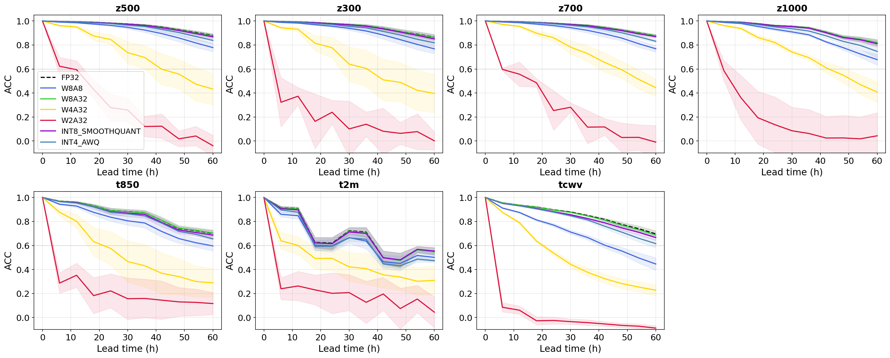
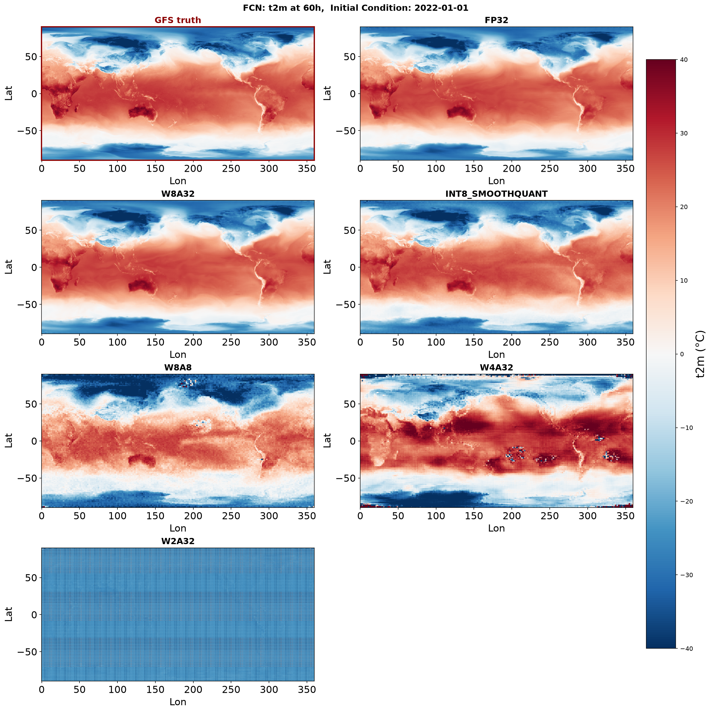

# WeatherQuantization
A systematic study of numerical precision effects on AI weather model inference. We characterize forecast skill degradation across a complete precision ladder using Post Training Quantization (PTQ). We use [NVIDIA Earth2Studio](https://nvidia.github.io/earth2studio/main/) and [ModelOptimizer](https://nvidia.github.io/Model-Optimizer/) to implement PTQ in two different AI emulators: 

- Deep Learning Weather Prediction (DLWP)
- FourCastNet (FCN)

## Directory
```text
WeatherQuantization/
├── src/
│   ├── dlwp.py
│   ├── fcn.py
│   ├── scripts/
│        ├── ...
│        └── ...
│
├── outputs/
│   ├── ACC results
│   └── RMSE results
│
├── .gitignore
└── README.md
```

The src directory contains the python codes to implement PTQ and run test for power consumption, inference time and memory footprint for each configuration. The subfolder scripts contains PBS scripts to run inferences on GPU. They have been written for NSF NCAR Casper HPC. outputs folder contains the root mean square error (RMSE) and anomaly correlation coefficient (ACC) for each PTQ experiment. We trace the evolution of forecast skill scores over a short-term forecast horizon.

## Results

### Forecast Skill Across the Precision Ladder

The following figure shows the evolution of forecast skill in DLWP model as numerical precision is reduced.



### Spatial map of 2m air temperature



## Citation 

If you use WeatherQuantization in your research, please cite:

```bibtex
@software{ananyo_bhattacharya_2026_21969498,
  author       = {Ananyo Bhattacharya and
                  Bhattacharya, Swastik Bimal},
  title        = {GalacticBobster/WeatherQuantization:
                  WeatherQuantv1.0},
  month        = aug,
  year         = 2026,
  publisher    = {Zenodo},
  version      = {v1.0},
  doi          = {10.5281/zenodo.21969498},
  url          = {https://doi.org/10.5281/zenodo.21969498},
}
```

## References
